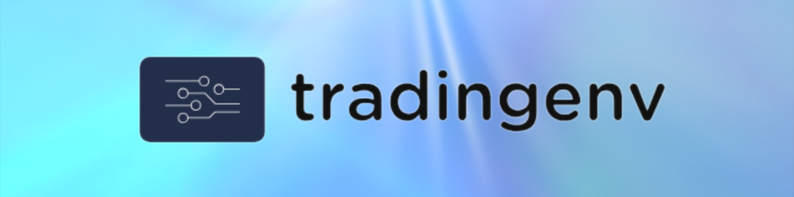
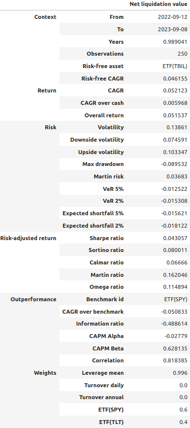
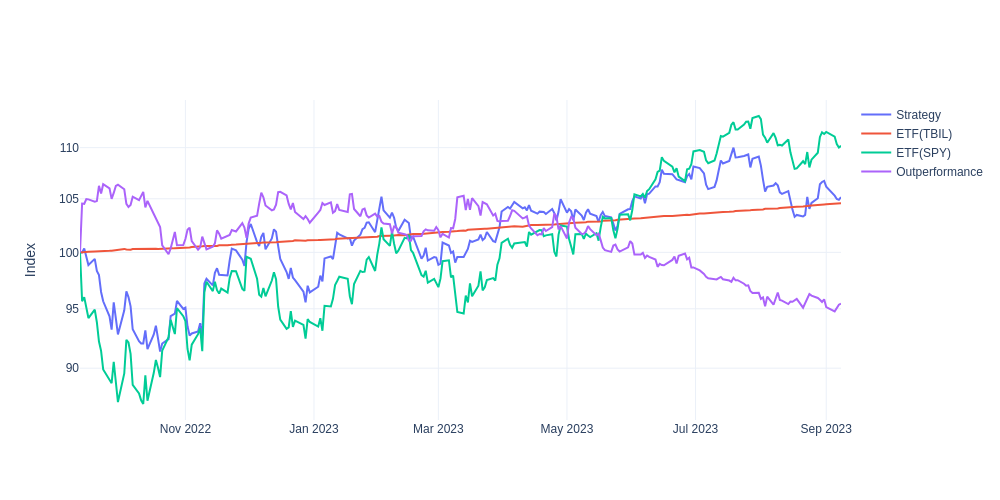

.. raw:: html

     
    
    
    
     
    
    

Introduction
============
Backtest trading strategies or train reinforcement learning agents with
:code:`tradingenv`, an event-driven market simulator that implements the
OpenAI/gym protocol.

Installation
============
tradingenv supports Python 3.7 or newer versions. The following command line
will install the latest software version.

.. code-block:: console

    pip install tradingenv

Notebooks, software tests and building the documentation require extra
dependencies that can be installed with

.. code-block:: console

    pip install tradingenv[extra]

Example - Reinforcement Learning
================================
The package is built upon the industry-standard gym_ and therefore can be used
in conjunction with popular reinforcement learning frameworks including rllib_
and stable-baselines3_.

.. code-block:: python

    >>> from tradingenv import TradingEnv
    >>> from tradingenv.contracts import ETF
    >>> from tradingenv.spaces import BoxPortfolio
    >>> from tradingenv.state import IState
    >>> from tradingenv.rewards import RewardLogReturn
    >>> from tradingenv.broker.fees import BrokerFees
    >>> from tradingenv.policy import AbstractPolicy
    >>> import yfinance

    # Load prices from Yahoo Finance and specify contract types.
    >>> prices = yfinance.Tickers(['SPY', 'TLT', 'TBIL']).history(period="12mo", progress=False)#['Close'].tz_localize(None)
    >>> #prices.columns = [ETF('SPY'), ETF('TLT'), ETF('TBIL')]
    >>> print(prices)

    # Instance the trading environment.
    >>> env = TradingEnv(
    ...     action_space=BoxPortfolio([ETF('SPY'), ETF('TLT')], low=-1, high=+1, as_weights=True),
    ...     state=IState(),
    ...     reward=RewardLogReturn(),
    ...     prices=prices,
    ...     initial_cash=1_000_000,
    ...     latency=0,  # seconds
    ...     steps_delay=1,  # trades are implemented with a delay on one step
    ...     broker_fees=BrokerFees(
    ...         markup=0.005,  # 0.5% broker markup on deposit rate
    ...         proportional=0.0001,  # 0.01% fee of traded notional
    ...         fixed=1,  # $1 per trade
    ...     ),
    ... )

    # OpenAI/gym protocol. Run an episode in the environment.
    # env can be passed to RL agents of ray/rllib or stable-baselines3.
    >>> obs = env.reset()
    >>> done = False
    >>> while not done:
    ...     action = env.action_space.sample()
    ...     obs, reward, done, info = env.step(action)

Example - Backtesting
=====================
Thanks to the event-driven design, tradingenv is agnostic with
respect to the type and time-frequency of the events. This means that you can
run simulations either using irregularly sampled trade and quotes data, daily
closing prices, monthly economic data or alternative data. Financial instruments
supported include stocks, ETF and futures.

.. code-block:: python

    >>> class Portfolio6040(AbstractPolicy):
    ...     """Implement logic of your investment strategy or RL agent here."""
    ...
    ...     def act(self, state):
    ...         """Invest 60% of the portfolio in SPY ETF and 40% in TLT ETF."""
    ...         return [0.6, 0.4]

    # Run the backtest.
    >>> track_record = env.backtest(
    ...     policy=Portfolio6040(),
    ...     risk_free=prices['TBIL'],
    ...     benchmark=prices['SPY'],
    ... )

    # The track_record object stores the results of your backtest.
    track_record.tearsheet()

.. code-block:: python

    track_record.fig_net_liquidation_value()

Relevant projects
=================
- btgym_: is an OpenAI Gym-compatible environment for
- backtrader_ backtesting/trading library, designed to provide gym-integrated framework for running reinforcement learning experiments in [close to] real world algorithmic trading environments.
- gym_: A toolkit for developing and comparing reinforcement learning algorithms.
- qlib_: Qlib provides a strong infrastructure to support quant research.
- rllib_: open-source library for reinforcement learning.
- stable-baselines3_: is a set of reliable implementations of reinforcement learning algorithms in PyTorch.

Developers
==========
You are welcome to contribute features, examples and documentation or issues.

You can run the software tests typing :code:`pytest` in the command line,
assuming that the folder :code:`\tests` is in the current working directory.

To refresh and build the documentation:

.. code-block::

   pytest tests/notebooks
   sphinx-apidoc -f -o docs/source tradingenv
   cd docs
   make clean
   make html

.. Hyperlinks.
.. _btgym: https://github.com/Kismuz/btgym
.. _backtrader: https://github.com/backtrader/backtrader
.. _gym: https://github.com/openai/gym
.. _qlib: https://github.com/microsoft/qlib
.. _rllib: https://docs.ray.io/en/latest/rllib/
.. _stable-baselines3: https://github.com/hill-a/stable-baselines
